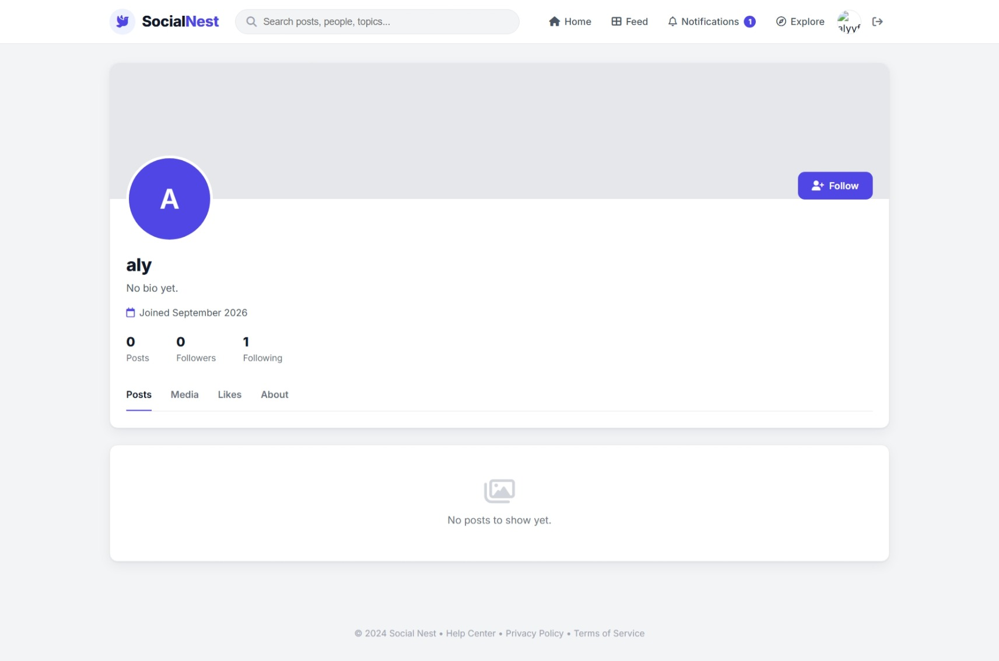
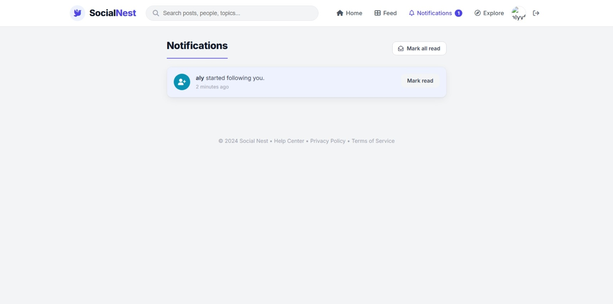
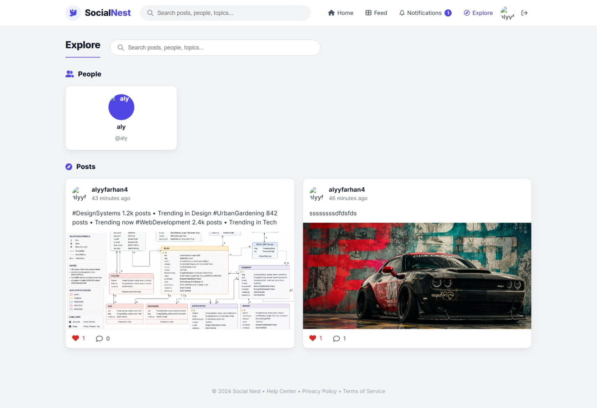
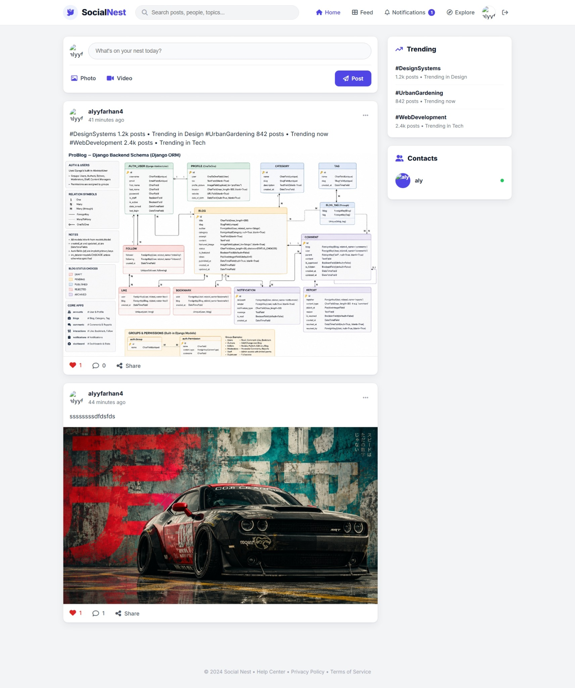
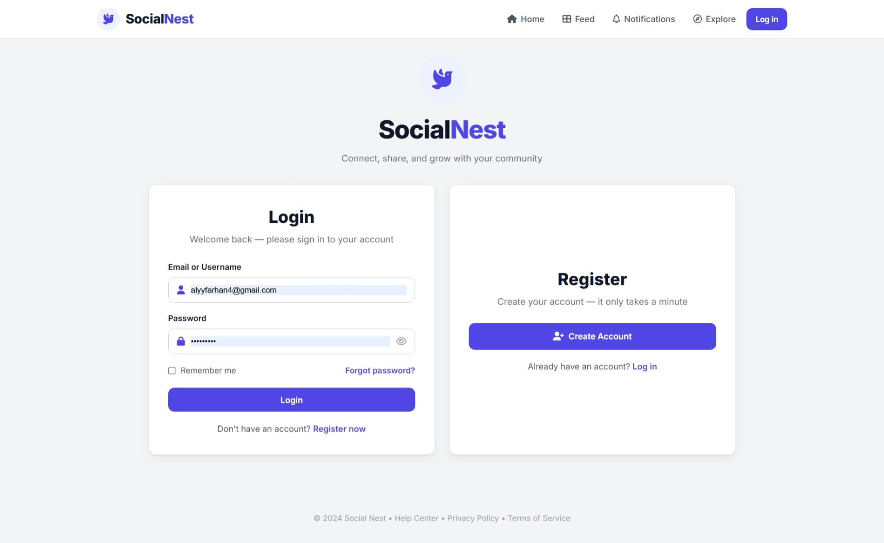
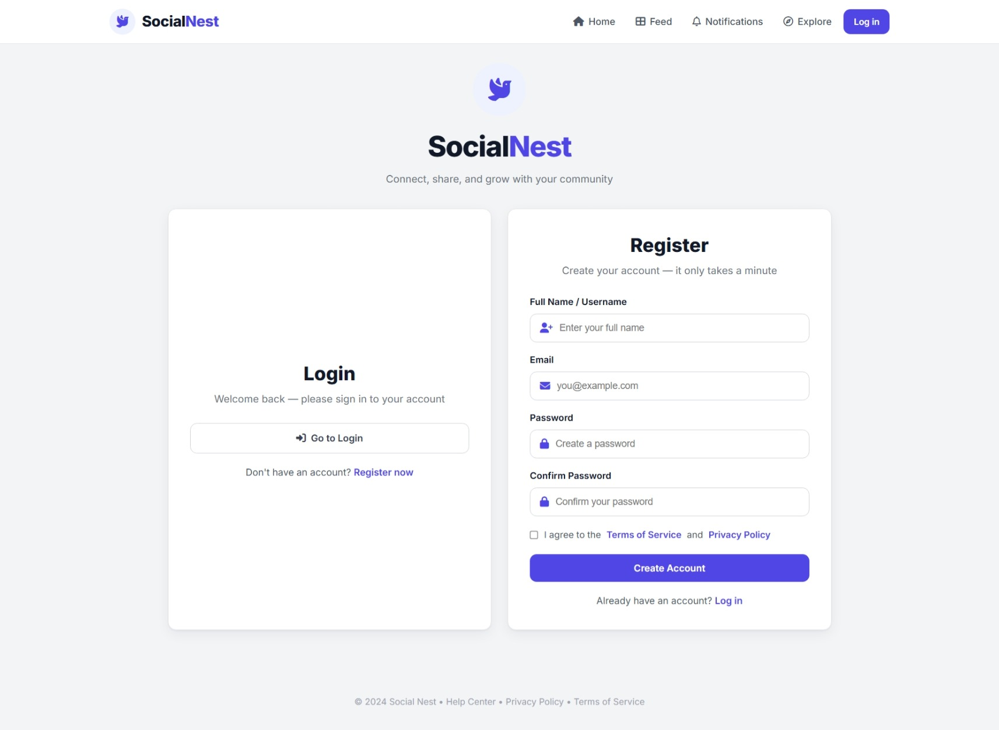

# SocialNest

SocialNest is a full-featured social networking web application built with **Django**. Users can share text, photos, and videos, follow other people, and interact through likes and comments. It also includes rich user profiles, a searchable Explore page, personalized feeds, and a notifications system.

---

## Screenshots

| Feed | Explore |
| --- | --- |
|  |  |

| Post Detail | Profile |
| --- | --- |
|  |  |

| Create Post | Notifications |
| --- | --- |
|  |  |

---

## Features

- **Authentication** - Register, log in, and log out (logout via secure POST).
- **Profiles** - Avatar, cover image, bio, location, and website. Editable profile page.
- **Posts** - Create posts with text (up to 280 chars), images, and video uploads.
- **Feed** - Personalized feed showing your posts and the people you follow.
- **Explore** - Browse and search all posts and people.
- **Likes & Comments** - Like/unlike posts and add comments; counts are tracked.
- **Follow system** - Follow/unfollow users and see follower/following counts.
- **Notifications** - Get notified on likes, comments, and new followers; mark one or all as read.
- **Search** - Search posts by text/author and people by username/name.

---

## Tech Stack

- **Backend:** Django (Python)
- **Database:** SQLite (development)
- **Frontend:** Django templates, custom CSS, Font Awesome icons, Google Fonts (Inter)
- **Media:** Local file storage for avatars, covers, and post media

---

## Project Structure

    socialNest/
    |-- accounts/          # Auth, profiles, follow system
    |-- posts/             # Posts, comments, likes, feed, explore
    |-- notifications/     # Notification model, list, mark-read
    |-- socialNest/        # Project settings and root URLs
    |-- static/            # CSS, JS, images (screenshots)
    |-- templates/         # HTML templates
    |-- media/             # User uploads (gitignored)
    |-- manage.py
    `-- db.sqlite3         # Dev database (gitignored)

---

## Getting Started

### Prerequisites

- Python 3.10+
- pip

### Installation

1. Clone the repository:

       git clone https://github.com/FarhanAli995/codeAlpha_SocialNest.git
       cd codeAlpha_SocialNest

2. Create and activate a virtual environment:

       python -m venv venv
       source venv/bin/activate      # macOS / Linux
       venv/Scripts/activate         # Windows

3. Install dependencies:

       pip install django pillow

4. Apply migrations:

       python manage.py migrate

5. Create a superuser (optional):

       python manage.py createsuperuser

6. Run the development server:

       python manage.py runserver

7. Open your browser at http://127.0.0.1:8000/

---

## Main Routes

| URL | Name | Description |
| --- | --- | --- |
| / | posts:feed | Personalized feed |
| /explore/ | posts:explore | Explore posts and people |
| /create/ | posts:post_create | Create a new post |
| /<pk>/ | posts:post_detail | Post detail with comments |
| /<pk>/like/ | posts:like_toggle | Like / unlike (POST) |
| /<pk>/comment/ | posts:add_comment | Add a comment (POST) |
| /accounts/register/ | accounts:register | Sign up |
| /accounts/login/ | accounts:login | Log in |
| /accounts/logout/ | accounts:logout | Log out (POST) |
| /accounts/profile/ | accounts:own_profile | Your profile |
| /accounts/profile/<username>/ | accounts:profile_detail | Another user's profile |
| /notifications/ | notifications:list | Notifications |

---

## Notes

- The db.sqlite3 database and the media/ folder are gitignored and not committed. Run migrations after cloning to create the database.
- Logout requires a POST request (Django 5+ security behavior); the logout button submits a form with a CSRF token.

---

## License

This project was built as part of the **CodeAlpha** internship program.
